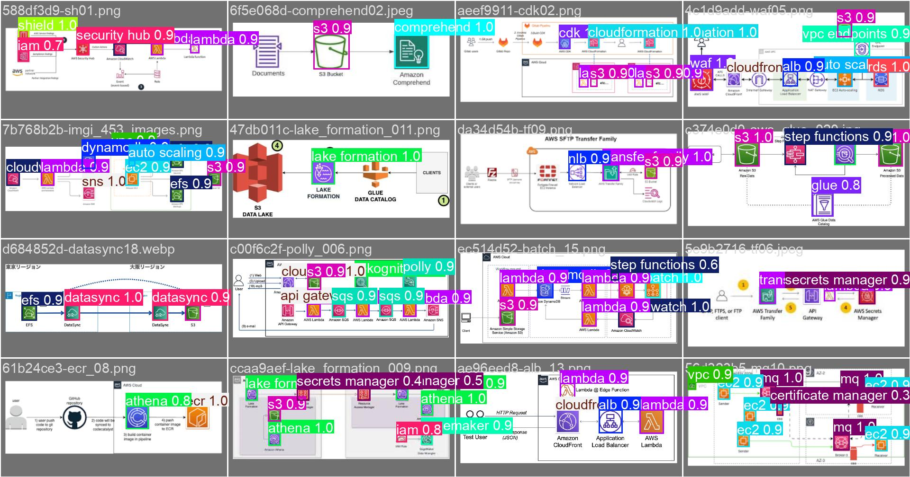
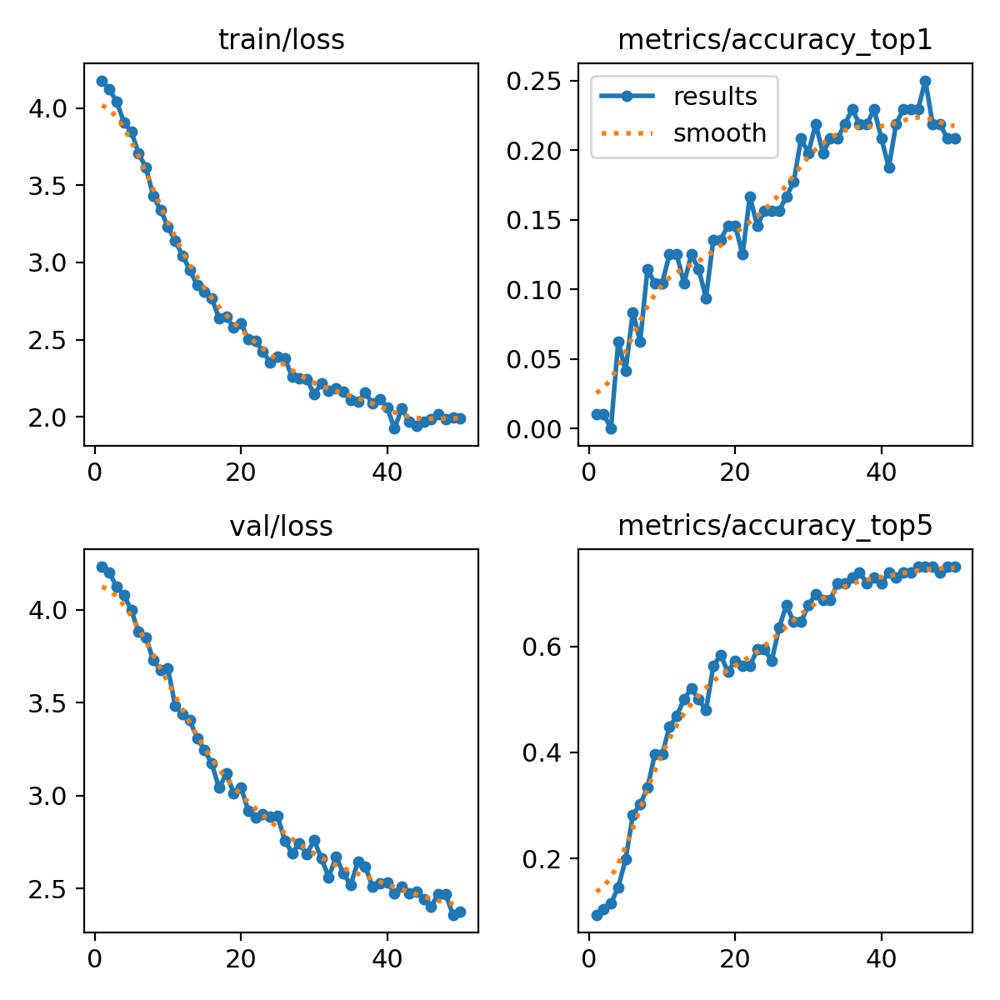
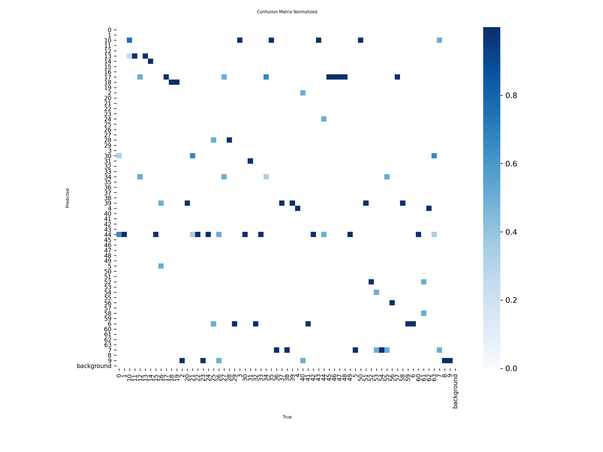
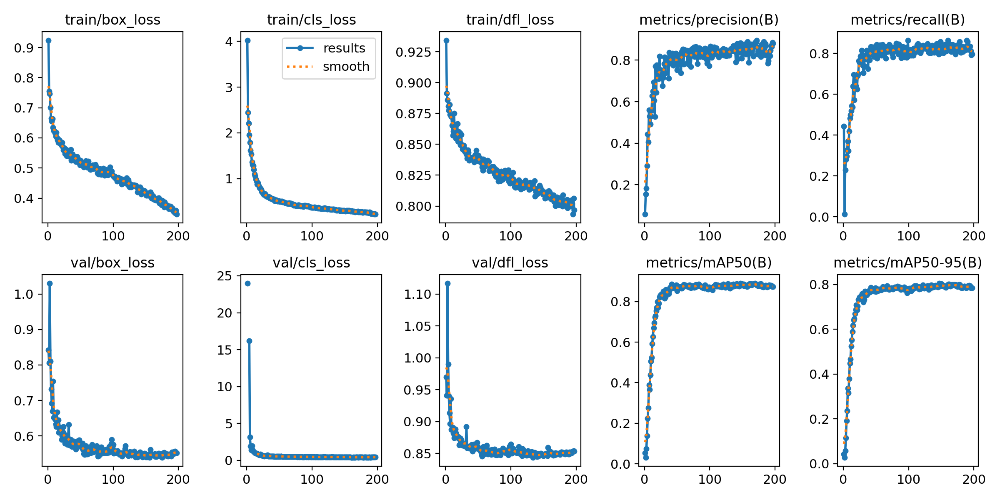
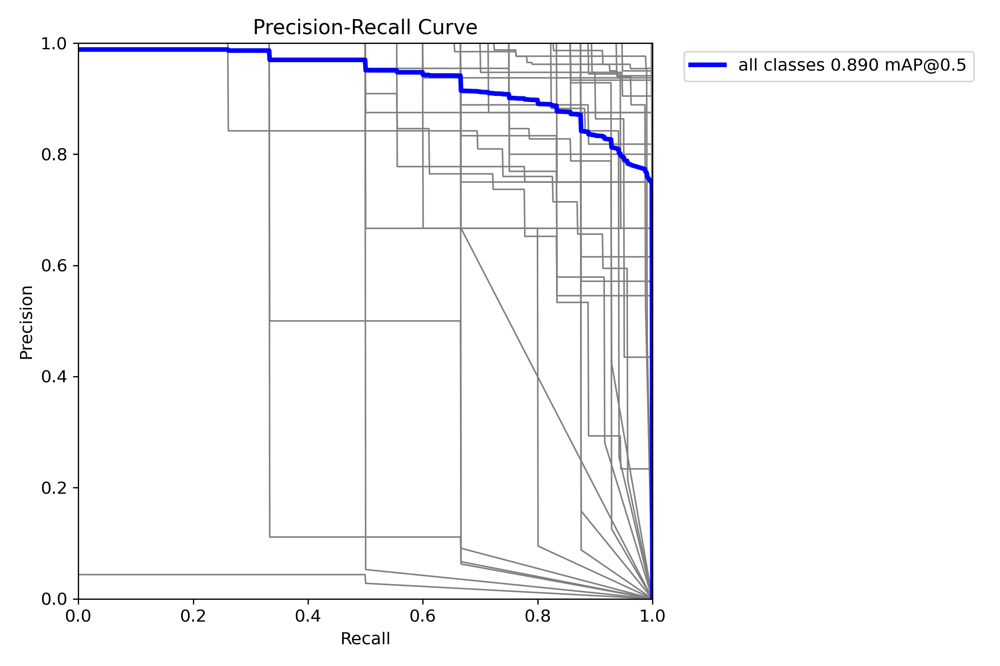
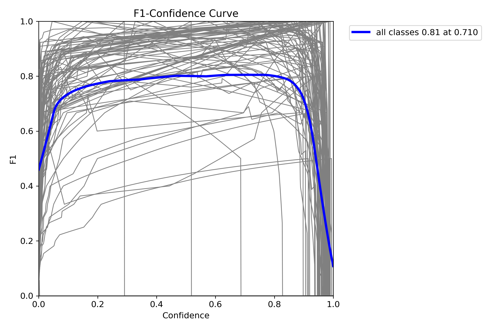
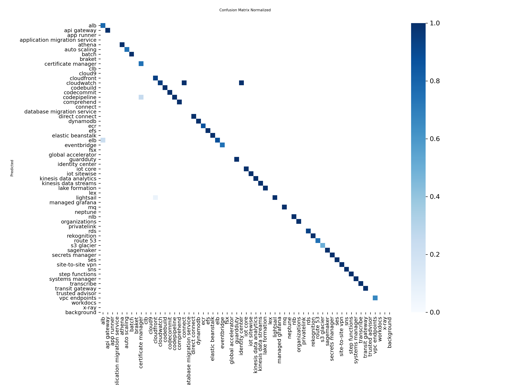

# ArchLens

AWS 아키텍처 다이어그램 분석을 위한 실험 프로젝트입니다. YOLO 모델을 사용하여:
- **Classification**: 개별 서비스 아이콘 이미지를 클래스로 분류
- **Detection**: 아키텍처 다이어그램에서 아이콘 위치를 탐지

두 가지 작업을 통해 다이어그램을 자동으로 분석합니다.

## 📸 실험 결과 미리보기

### Classification 실험 예측 결과
**입력**: 개별 서비스 아이콘 이미지 (64x64 픽셀)  
**출력**: 서비스 클래스 예측 (Top-5)


### Detection 실험 예측 결과
**입력**: AWS 아키텍처 다이어그램 (여러 아이콘 포함)  
**출력**: 바운딩 박스로 표시된 아이콘 위치 및 서비스 클래스


> 💡 **참고**: 실험 결과 이미지는 로컬에서 확인하거나, [experiments/README.md](experiments/README.md)를 참고하세요.

## 🎯 주요 기능

- **YOLO Classification**: 개별 AWS 서비스 아이콘 이미지를 입력받아 "무슨 서비스인가?"를 분류
  - 입력: 단일 아이콘 이미지 (예: S3 아이콘 1개, 64x64 픽셀)
  - 출력: 서비스 클래스 및 신뢰도 (예: "Amazon S3: 92.3%")
  
- **YOLO Detection**: AWS 아키텍처 다이어그램 전체를 입력받아 "어디에 어떤 아이콘이 있는가?"를 탐지
  - 입력: 아키텍처 다이어그램 이미지 (여러 아이콘이 포함된 큰 이미지)
  - 출력: 바운딩 박스 좌표 + 서비스 클래스 (각 아이콘의 위치와 종류)
- **실험 결과 시각화**: 학습 곡선, Confusion Matrix, 예측 결과 시각화

## 🏗️ 아키텍처

```bash
ArchLens/
├── experiments/            # 실험 디렉터리
│   ├── classification/    # YOLO Classification 실험
│   └── detection/         # YOLO Detection 실험
├── backend/               # 백엔드 패키지
├── data/                  # 데이터
├── docs/                  # 문서
└── scripts/               # 스크립트 파일
```


## 🚀 빠른 시작 (uv)

```bash
git clone https://github.com/sungminwoo0612/hit-archlens-project.git
cd hit-archlens-project
uv sync
uv run archlens demo
```

**또는 직접 이미지 분석:**
```bash
uv run archlens analyze <이미지_경로> --output runs/demo
```

**요구사항:**
- Python: 3.10+ (3.11+ 권장)
- uv: [설치 가이드](https://docs.astral.sh/uv/)

> 💡 **다른 환경 관리 도구 사용하기**: conda를 사용하려면 [docs/setup_conda.md](docs/setup_conda.md)를 참고하세요.


## 📁 출력 구조

`archlens analyze` 또는 `archlens demo` 실행 후 생성되는 파일 구조:

```
runs/demo/
├── demo_result.json                    # 데모 분석 결과 (JSON)
└── hybrid_results_conf_0_5/            # analyze 명령어 출력 (임계값별)
    ├── analysis_result_000.json        # 개별 이미지 분석 결과
    ├── visualizations/                  # 시각화 결과
    │   ├── confidence_distribution.png
    │   ├── service_distribution.png
    │   ├── processing_time.png
    │   ├── detection_counts.png
    │   ├── normalization_success_rate.png
    │   ├── detection_status_distribution.png
    │   └── {image_name}_detections.jpg # 바운딩 박스가 그려진 이미지
    └── evaluation/                      # 평가 결과 (여러 임계값 사용 시)
        └── threshold_analysis/
            └── hybrid_threshold_summary.csv
```

**주요 출력 파일 설명**:
- `demo_result.json`: 단일 이미지 분석 결과 (서비스명, 신뢰도, 바운딩 박스 좌표)
- `analysis_result_*.json`: 배치 분석 시 각 이미지별 결과
- `*_detections.jpg`: 원본 이미지에 바운딩 박스와 레이블이 그려진 시각화 결과

## 🎯 YOLO Classification 학습

**목적**: 개별 AWS 서비스 아이콘 이미지를 입력받아 서비스 클래스를 분류하는 모델 학습

**사용 사례**: 
- 아이콘 이미지 1개가 주어졌을 때 "이게 무슨 AWS 서비스인가?"를 판단
- 입력: 단일 아이콘 이미지 (예: `Arch_Amazon-S3_64.png`)
- 출력: 서비스 클래스 및 신뢰도 (예: "Amazon S3: 92.3%")

### 빠른 시작

#### 1. 데이터셋 준비

라벨링 작업: Label Studio를 사용하여 AWS 다이어그램에서 아이콘 위치 및 클래스 라벨링

**라벨링 작업 화면**: [라벨링 작업 화면](archlens_라벨링.png)

```bash
uv run python scripts/prepare_yolo_dataset.py --mode fine
```

#### 2. 모델 학습

```bash
uv run python scripts/train_yolo_cls.py --mode fine --epochs 100 --imgsz 256
```

#### 3. 모델 평가

```bash
uv run python scripts/eval_yolo_cls.py \
    --model runs/classify/fine_cls_*/weights/best.pt \
    --mode fine \
    --split test
```

#### 4. 이미지 예측

**단일 이미지:**
```bash
uv run python scripts/predict_yolo_cls.py \
    --model runs/classify/fine_cls_yolov8n-cls/weights/best.pt \
    --source "dataset/icons/images/fine/amazon s3/Arch_Amazon-S3_64.png" \
    --mode fine \
    --top-k 5
```

**디렉터리 전체:**
```bash
uv run python scripts/predict_yolo_cls.py \
    --model runs/classify/fine_cls_yolov8n-cls/weights/best.pt \
    --source "dataset/icons/images/fine/amazon s3" \
    --mode fine \
    --save-json \
    --save-txt
```

### 상세 가이드

## 📊 실험 결과

### 최고 성능 실험: YOLO Classification (yolo-cls16)

최고 성능을 달성한 YOLO Classification 실험 결과입니다.

**성능 지표:**
- Top-1 Accuracy: 20.83%
- Top-5 Accuracy: 75.00%
- Validation Loss: 2.375
- 클래스 수: 64개 (fine-grained)
- 데이터 분할: Train 447 / Val 96 / Test 96

**시각화 결과:**

#### 학습 곡선


#### Confusion Matrix


#### 검증 예측 결과


더 자세한 실험 결과는 [experiments/README.md](experiments/README.md)를 참고하세요.

### 최고 성능 실험: YOLO Detection (aws_icon_detector_trial_14)

최고 성능을 달성한 YOLO Detection 실험 결과입니다.

**성능 지표:**
- mAP50-95: 80.48%
- 최적 하이퍼파라미터: Learning Rate 0.00298, Optimizer AdamW
- 클래스 수: 119개 AWS 서비스
- 데이터셋: ~1,000개 이미지

**시각화 결과:**

#### 학습 곡선


#### Precision-Recall 곡선


#### F1 Score 곡선


#### Confusion Matrix


#### 검증 예측 결과


## 🔍 YOLO Detection 학습

**목적**: AWS 아키텍처 다이어그램 전체에서 아이콘의 위치와 종류를 탐지하는 모델 학습

**사용 사례**:
- 아키텍처 다이어그램 이미지가 주어졌을 때 "어디에 어떤 서비스 아이콘이 있는가?"를 탐지
- 입력: 아키텍처 다이어그램 이미지 (여러 아이콘이 포함된 큰 이미지)
- 출력: 바운딩 박스 좌표 + 서비스 클래스 (각 아이콘의 위치와 종류)

더 자세한 내용은 [experiments/README.md](experiments/README.md)를 참고하세요.

## 📚 문서

프로젝트의 모든 문서는 `docs/` 디렉터리에 체계적으로 정리되어 있습니다.

- **사용 가이드** (`docs/01_guides/`): 
  - [YOLO 학습 가이드](docs/01_guides/01_yolo_training_guide.md)
  - [추론 가이드](docs/01_guides/02_inference_guide.md)
- **참고 자료** (`docs/02_reference/`): 프로젝트 개요, 모듈 비교, 기술 용어집 등

## 🔗 관련 링크

- [AWS 공식 아이콘](https://aws.amazon.com/ko/architecture/icons/)
- [OpenAI API 문서](https://platform.openai.com/docs/)
- [CLIP 모델](https://github.com/openai/CLIP)
- [OpenCLIP](https://github.com/mlfoundations/open_clip)
