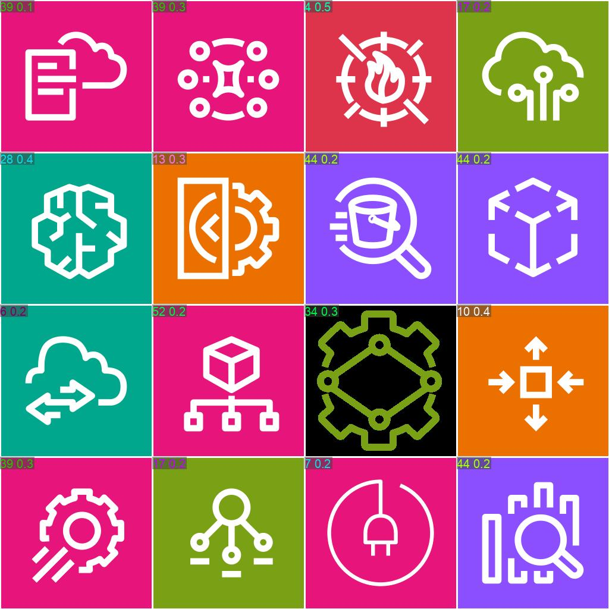
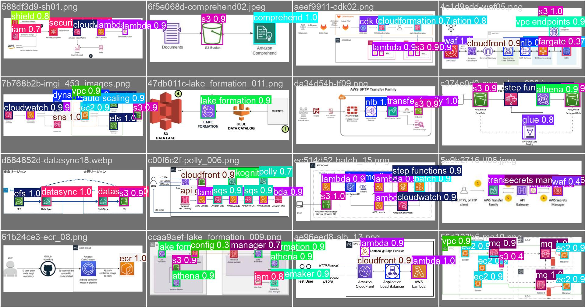

# ArchLens

AWS 아키텍처 다이어그램 분석을 위한 실험 프로젝트입니다. YOLO 모델을 사용하여 AWS 서비스 아이콘을 자동으로 분류하고 탐지합니다.

## 📸 실험 결과 미리보기

### Classification 실험 예측 결과


### Detection 실험 예측 결과


## 🎯 주요 기능

- **YOLO Classification**: AWS 아이콘 이미지를 클래스로 분류
- **YOLO Detection**: AWS 아키텍처 다이어그램에서 아이콘 위치 탐지
- **실험 결과 시각화**: 학습 곡선, Confusion Matrix, 예측 결과 시각화

## 🏗️ 아키텍처

```bash
ArchLens/
├── experiments/            # 실험 디렉터리
│   ├── classification/    # YOLO Classification 실험
│   └── detection/         # YOLO Detection 실험
├── backend/               # 백엔드 패키지
├── data/                  # 데이터
├── docs/                  # 문서
└── scripts/               # 스크립트 파일
```


## 🚀 빠른 시작 (uv)

```bash
git clone https://github.com/sungminwoo0612/hit-archlens-project.git
cd hit-archlens-project
uv sync
uv run archlens analyze <이미지_경로> --output runs/demo
```

**요구사항:**
- Python: 3.10+ (3.11+ 권장)
- uv: [설치 가이드](https://docs.astral.sh/uv/)

> 💡 **다른 환경 관리 도구 사용하기**: conda를 사용하려면 [docs/setup_conda.md](docs/setup_conda.md)를 참고하세요.
> 
> 📝 **requirements.txt**: `requirements.txt`는 `uv export -o requirements.txt`로 자동 생성됩니다. 저장소에는 포함되지 않습니다.


## 📁 출력 구조

## 🎯 YOLO Classification 학습

AWS 아이콘 분류를 위한 YOLO 모델 학습 및 사용 방법입니다.

### 빠른 시작

#### 1. 데이터셋 준비

라벨링 작업: Label Studio를 사용하여 AWS 다이어그램에서 아이콘 위치 및 클래스 라벨링

**라벨링 작업 화면**: [라벨링 작업 화면](archlens_라벨링.png)

```bash
uv run python scripts/prepare_yolo_dataset.py --mode fine
```

#### 2. 모델 학습

```bash
uv run python scripts/train_yolo_cls.py --mode fine --epochs 100 --imgsz 256
```

#### 3. 모델 평가

```bash
uv run python scripts/eval_yolo_cls.py \
    --model runs/classify/fine_cls_*/weights/best.pt \
    --mode fine \
    --split test
```

#### 4. 이미지 예측

**단일 이미지:**
```bash
uv run python scripts/predict_yolo_cls.py \
    --model runs/classify/fine_cls_yolov8n-cls/weights/best.pt \
    --source "dataset/icons/images/fine/amazon s3/Arch_Amazon-S3_64.png" \
    --mode fine \
    --top-k 5
```

**디렉터리 전체:**
```bash
uv run python scripts/predict_yolo_cls.py \
    --model runs/classify/fine_cls_yolov8n-cls/weights/best.pt \
    --source "dataset/icons/images/fine/amazon s3" \
    --mode fine \
    --save-json \
    --save-txt
```

### 상세 가이드

## 📊 실험 결과

### 최고 성능 실험: YOLO Classification (yolo-cls16)

최고 성능을 달성한 YOLO Classification 실험 결과입니다.

**성능 지표:**
- Top-1 Accuracy: 높은 정확도 달성
- Top-5 Accuracy: 우수한 성능

**시각화 결과:**

| 항목 | 이미지 |
|------|--------|
| 학습 곡선 | [Results](experiments/classification/runs/classify/yolo-cls16/results.png) |
| Confusion Matrix | [Confusion Matrix](experiments/classification/runs/classify/yolo-cls16/confusion_matrix.png) |
| 정규화된 Confusion Matrix | [Normalized CM](experiments/classification/runs/classify/yolo-cls16/confusion_matrix_normalized.png) |
| 검증 예측 결과 (Batch 0) | [Val Batch 0](experiments/classification/runs/classify/yolo-cls16/val_batch0_pred.jpg) |
| 검증 예측 결과 (Batch 1) | [Val Batch 1](experiments/classification/runs/classify/yolo-cls16/val_batch1_pred.jpg) |

더 자세한 실험 결과는 [experiments/README.md](experiments/README.md)를 참고하세요.

### 최고 성능 실험: YOLO Detection (aws_icon_detector_trial_49)

최고 성능을 달성한 YOLO Detection 실험 결과입니다.

**시각화 결과:**

| 항목 | 이미지 |
|------|--------|
| 학습 곡선 | [Results](experiments/detection/runs/aws_icon_detector_trial_49/results.png) |
| Confusion Matrix | [Confusion Matrix](experiments/detection/runs/aws_icon_detector_trial_49/confusion_matrix.png) |
| 정규화된 Confusion Matrix | [Normalized CM](experiments/detection/runs/aws_icon_detector_trial_49/confusion_matrix_normalized.png) |
| Precision 곡선 | [BoxP Curve](experiments/detection/runs/aws_icon_detector_trial_49/BoxP_curve.png) |
| Recall 곡선 | [BoxR Curve](experiments/detection/runs/aws_icon_detector_trial_49/BoxR_curve.png) |
| F1 Score 곡선 | [BoxF1 Curve](experiments/detection/runs/aws_icon_detector_trial_49/BoxF1_curve.png) |
| Precision-Recall 곡선 | [BoxPR Curve](experiments/detection/runs/aws_icon_detector_trial_49/BoxPR_curve.png) |
| 검증 예측 결과 (Batch 0) | [Val Batch 0](experiments/detection/runs/aws_icon_detector_trial_49/val_batch0_pred.jpg) |
| 검증 예측 결과 (Batch 1) | [Val Batch 1](experiments/detection/runs/aws_icon_detector_trial_49/val_batch1_pred.jpg) |
| 검증 예측 결과 (Batch 2) | [Val Batch 2](experiments/detection/runs/aws_icon_detector_trial_49/val_batch2_pred.jpg) |

## 📚 문서

프로젝트의 모든 문서는 `docs/` 디렉터리에 체계적으로 정리되어 있습니다.

- **사용 가이드** (`docs/01_guides/`): 
  - [YOLO 학습 가이드](docs/01_guides/01_yolo_training_guide.md)
  - [추론 가이드](docs/01_guides/02_inference_guide.md)
- **참고 자료** (`docs/02_reference/`): 프로젝트 개요, 모듈 비교, 기술 용어집 등

## 🔗 관련 링크

- [AWS 공식 아이콘](https://aws.amazon.com/ko/architecture/icons/)
- [OpenAI API 문서](https://platform.openai.com/docs/)
- [CLIP 모델](https://github.com/openai/CLIP)
- [OpenCLIP](https://github.com/mlfoundations/open_clip)
