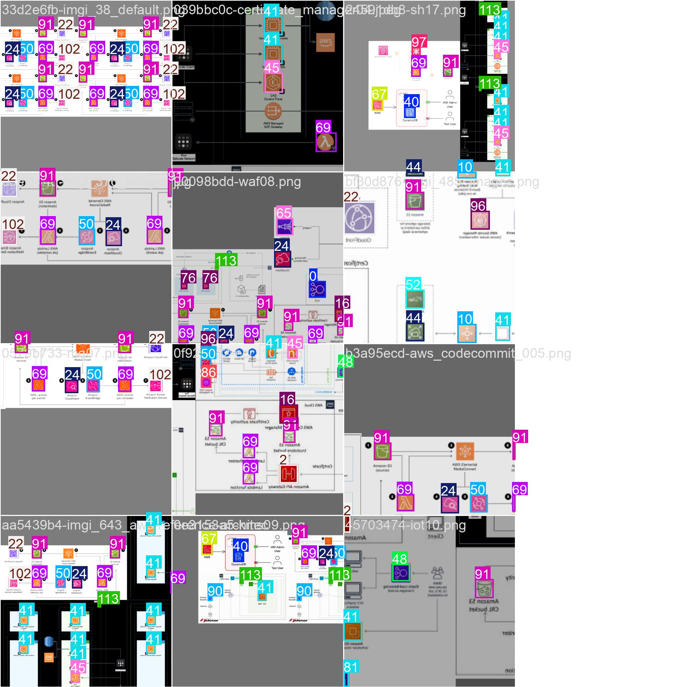

# 실험 결과 요약

이 디렉터리에는 AWS 아키텍처 다이어그램 분석을 위한 두 가지 주요 실험이 포함되어 있습니다.

## 📊 실험 개요

| 실험 | 목적 | 모델 | 데이터셋 크기 | 클래스 수 |
|------|------|------|--------------|----------|
| **Classification** | AWS 아이콘 이미지 분류 | YOLO Classification | 639개 (fine) | 64개 |
| **Detection** | 다이어그램에서 아이콘 위치 탐지 | YOLO Detection | ~1,000개 | 119개 |

---

## 🎯 1. Classification 실험 (아이콘 분류)

### 목적
AWS 아이콘 이미지를 클래스로 분류하는 모델 학습

### 데이터셋
- **Train**: 447개 이미지
- **Validation**: 96개 이미지  
- **Test**: 96개 이미지
- **총 클래스 수**: 64개 (fine-grained)

### 최고 성능 실험: `yolo-cls16`

#### 성능 지표
- **Top-1 Accuracy**: 20.83%
- **Top-5 Accuracy**: 75.00%
- **Validation Loss**: 2.375

#### 학습 곡선

*학습 과정에서의 Loss와 Accuracy 변화. Top-5 Accuracy가 75%에 도달하여 상위 5개 예측 중 정답이 포함될 확률이 높음을 보여줍니다.*

#### Confusion Matrix

*정규화된 혼동 행렬. 대각선이 진할수록 해당 클래스의 분류 정확도가 높음을 의미합니다. 64개 클래스에 대한 분류 성능을 시각적으로 확인할 수 있습니다.*

#### 검증 결과 예시

*검증 데이터셋에 대한 예측 결과 예시. 각 이미지 위에 예측된 클래스와 신뢰도가 표시됩니다. Top-5 예측 중 정답이 포함되는 경우가 많음을 확인할 수 있습니다.*

---

## 🔍 2. Detection 실험 (다이어그램 객체 탐지)

### 목적
AWS 아키텍처 다이어그램에서 아이콘의 위치를 바운딩 박스로 탐지

### 데이터셋
- **이미지 수**: ~1,000개
- **클래스 수**: 119개 AWS 서비스
- **라벨 형식**: YOLO format (class_id x y w h)

### 최고 성능 실험: Optuna Trial #14 ⭐

#### 성능 지표
- **최적 mAP50-95**: **80.48%** 🎯
- **최적 하이퍼파라미터**:
  - Learning Rate (lr0): 0.00298
  - Optimizer: AdamW
  - Weight Decay: 0.000388
  - Patience: 50

#### 학습 곡선

Detection 모델의 학습 과정. mAP50-95가 80.48%에 도달하여 높은 탐지 정확도를 보여줍니다. Precision, Recall, mAP50, mAP50-95 등의 지표가 에포크에 따라 개선되는 것을 확인할 수 있습니다.

#### Precision-Recall 곡선

Precision-Recall 곡선. 곡선 아래 면적(AUC)이 클수록 모델의 성능이 우수함을 나타냅니다. 119개 클래스에 대한 평균 PR 곡선을 보여줍니다.

#### F1 Score 곡선

F1 Score 곡선. Precision과 Recall의 조화 평균으로, 최적의 confidence threshold를 찾는 데 유용합니다. Confidence threshold에 따른 F1 Score 변화를 확인할 수 있습니다.

#### Confusion Matrix

119개 클래스에 대한 정규화된 혼동 행렬. 클래스 간 혼동 패턴을 시각적으로 확인할 수 있습니다. 유사한 서비스들(예: EC2, ECS, EKS) 간의 혼동이 발생할 수 있음을 보여줍니다.

#### 검증 결과 예시

검증 데이터셋에 대한 바운딩 박스 예측 결과. 각 아이콘의 위치와 클래스가 정확하게 탐지되었는지 확인할 수 있습니다. 바운딩 박스와 클래스 레이블이 표시되어 있습니다.

#### 학습 배치 예시

학습 중 사용된 배치 이미지 예시. 다양한 AWS 서비스 아이콘이 포함된 다이어그램을 보여줍니다. 실제 학습에 사용된 데이터의 다양성을 확인할 수 있습니다.

---

## 📈 성능 비교

### Classification
| 실험 | Top-1 Acc | Top-5 Acc | 모델 | 에포크 |
|------|-----------|-----------|------|--------|
| yolo-cls16 | 20.83% | 75.00% | YOLOv8n-cls | 50 |
| fine_cls_yolov8n-cls | - | - | YOLOv8n-cls | 100+ |

### Detection
| 실험 | mAP50-95 | mAP50 | Precision | Recall | 모델 |
|------|----------|-------|-----------|--------|------|
| **Trial #14** ⭐ | **80.48%** | - | - | - | YOLOv8s |
| aws_diagram_yolov8m_v1 | 66.75% | 75.20% | 83.36% | 63.65% | YOLOv8m |

---

## 📁 디렉터리 구조

```
experiments/
├── classification/          # 아이콘 분류 실험
│   ├── notebooks/          # 00~13번 노트북
│   ├── scripts/            # 학습/평가/추론 스크립트
│   ├── data/               # 데이터셋
│   │   └── dataset/icons/
│   ├── runs/               # 실험 결과
│   │   └── classify/
│   └── weights/            # 모델 가중치
│
└── detection/              # 다이어그램 객체 탐지 실험
    ├── notebooks/          # 14번 노트북
    ├── scripts/            # 학습 스크립트
    ├── data/               # 다이어그램 데이터
    │   └── aws_diagram_data/
    ├── runs/               # 실험 결과
    │   ├── aws_icon_detector_trial_*/  # Optuna 실험
    │   ├── aws_diagram_yolov8m_v1/     # YOLOv8m 실험
    │   └── aws_icon_detector2~7/       # 이전 실험
    ├── experiments/        # Optuna 메타데이터
    │   ├── optuna_studies/
    │   └── summaries/
    ├── dataset.yaml        # YOLO 데이터셋 설정
    └── weights/            # 모델 가중치
```

---

## 🚀 빠른 시작

### Classification 실험 실행
```bash
cd classification/scripts
python train_yolo_cls.py --mode fine --epochs 100 --imgsz 256
```

### Detection 실험 실행
```bash
cd detection/scripts
python train.py  # Optuna 최적화 포함 (50 trials)
```

---

## 📝 참고 자료

- **노트북**: 각 실험 디렉터리의 `notebooks/` 폴더 참조
- **상세 결과**: 각 실험의 `runs/` 디렉터리에서 `results.csv` 확인
- **시각화**: `confusion_matrix.png`, `results.png` 등 확인
- **최적 모델**: 
  - Classification: `classification/runs/classify/yolo-cls16/weights/best.pt`
  - Detection: `detection/runs/aws_icon_detector_trial_14/weights/best.pt`

---

**마지막 업데이트**: 2026-01-13

